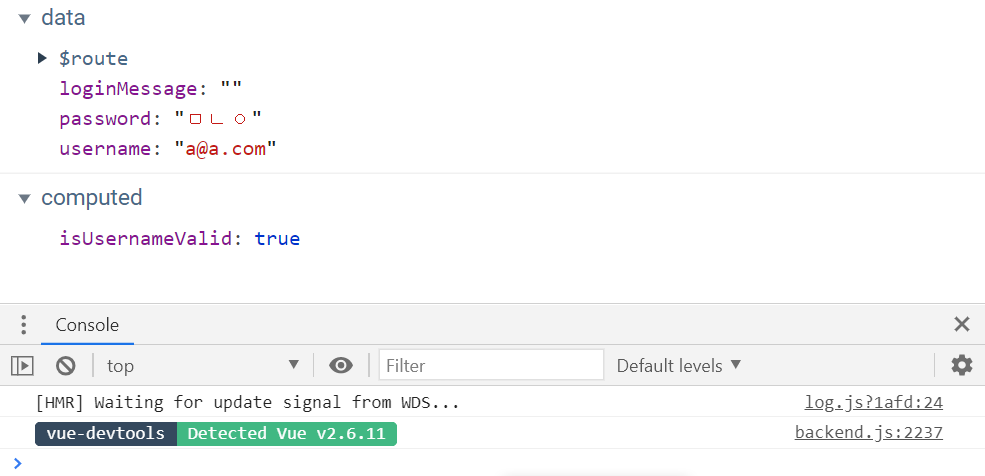

📌 유효성 검사
-
* 유효성 검사는 프로그램의 폼이 있는 곳이라면 어디서나 광범위 하게 진행이 되기 때문에, 별도의 파일에서 모아서 진행하는 것이 좋다. 


<br/>

📌 vue 에서 유효성 검사를 진행할 때는
-
* vue 에서의 유효성 검사는 다음과 같이 computed 속성을 이용한다.
```javascript
computed: {
  isUsernameValid() {
    return validateEmail(this.username);
  },
},
```
* 이 속성은 주로 간단한 계산을 하는데, 값이 자동으로 계산되는 특징이 있다.


<br/>


📌 유효성 검사 디버깅 (computed 속성 디버깅)
-
* vue 에서 유효성 검사는 개발자 도구를 이용해서 확인 하면 된다. 이때 computed 속성을 사용한다.

* computed 속성을 사용하기 때문에, 개발자 도구로 디버깅 하면서 확인할 수 있다.


<br/>


📌 이메일의 정규식 검사를 진행해보자.
-

이메일 유효성 검사를 할 수 있는 정규식은 [링크](https://stackoverflow.com/questions/46155/how-to-validate-an-email-address-in-javascript#) 에서 구할 수 있다.

1. src/util 아래에 validation.js 파일 생성
    ```javascript
    function validateEmail(email) {
      var re =
        /^(([^<>()[\]\\.,;:\s@"]+(\.[^<>()[\]\\.,;:\s@"]+)*)|(".+"))@((\[[0-9]{1,3}\.[0-9]{1,3}\.[0-9]{1,3}\.[0-9]{1,3}\])|(([a-zA-Z\-0-9]+\.)+[a-zA-Z]{2,}))$/;
      return re.test(String(email).toLowerCase());
    }
    
    export { validateEmail };
    ```
2. computed 속성을 이용해서 정규식 검사 진행
    ```javascript
    computed: {
      isUsernameValid() {
        return validateEmail(this.username);
      },
    },
    ```


